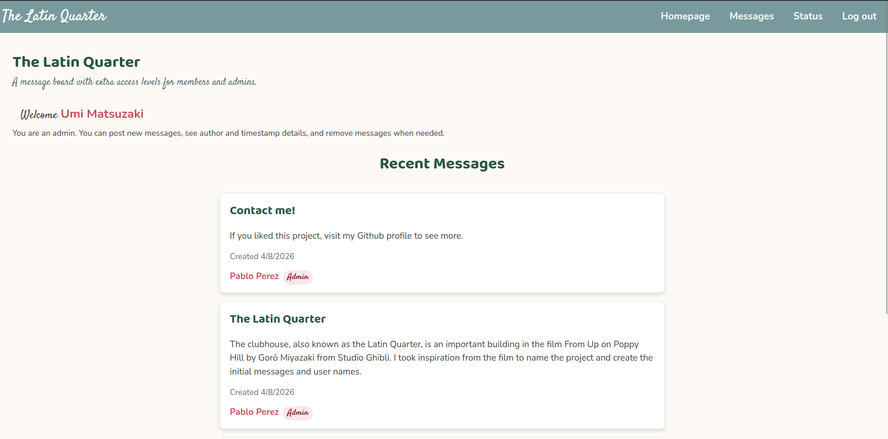
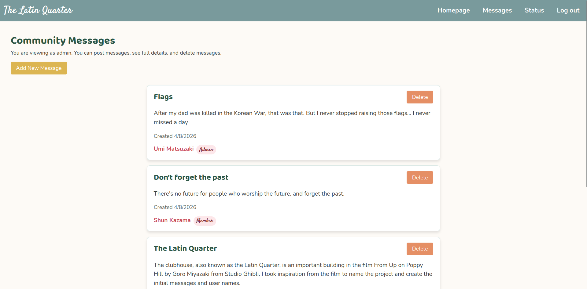
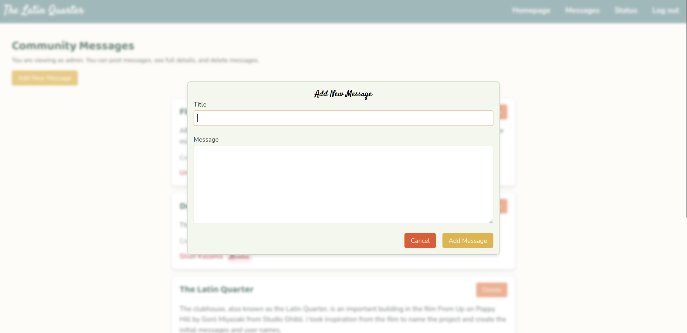
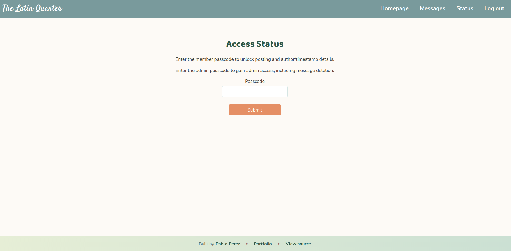
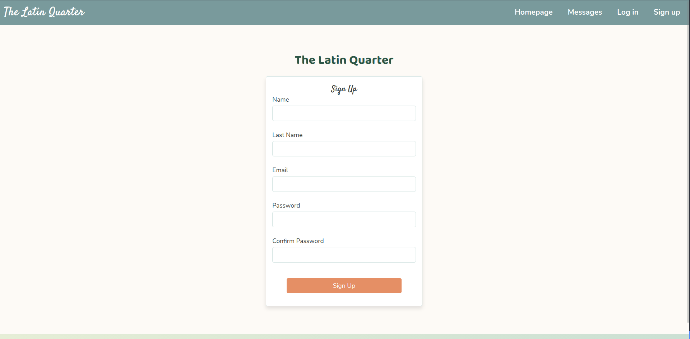
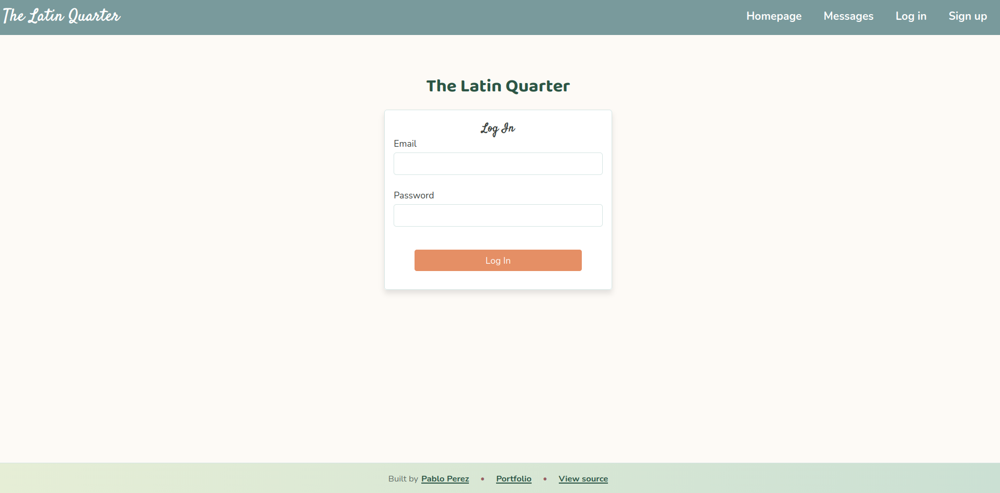

# The Latin Quarter (Members-Only Message Board)

**The Latin Quarter** is a members-only message board application built as part of The Odin Project's Node.js curriculum. It demonstrates user authentication, role-based access control, and real-time messaging functionality.

- **Live Page:** [https://the-latin-quarter.onrender.com](https://the-latin-quarter.onrender.com)

Note: This app may take ~30 seconds to load due to free tier cold start of Render.

- **Project Requirements:** [The Odin Project - Members Only](https://www.theodinproject.com/lessons/node-path-nodejs-members-only)

---

## How It Works

This application provides different levels of access based on user status:

1.  **Public View:** Anyone can view the message board, but author names and message timestamps are hidden.
2.  **User Registration:** Users can sign up for an account. By default, new users are not members.
3.  **Member Access:** To become a member and gain the ability to post messages and see author details, users must enter a special passcode.
4.  **Admin Access:** A separate passcode grants admin privileges, allowing the user to delete any message.

### Passcodes

-   **Member Passcode:** `I am, unfortunately, the Hero of Ages`
-   **Admin Passcode:** `supercalifragilisticexpialidocious`

---

## Screenshots

### Homepage

### Messages Page

### Add New Message

### Status Page

### Sign Up

### Log In

---

## Technology Stack

-   **Backend:** Node.js, Express.js, PostgreSQL
-   **Frontend:** EJS, CSS, JavaScript
-   **Libraries:** bcryptjs (password hashing), express-validator (form validation), express-session (session management), Passport.js (for authentication)

---

## Features

-   Secure user authentication with password hashing.
-   Role-based access control (guest, member, admin).
-   Server-side and client-side form validation.
-   Message creation and deletion for authorized users.
-   Session management to maintain user login state.

## Author 

**My Portfolio:** [https://yaoming16.github.io/](https://yaoming16.github.io/)
